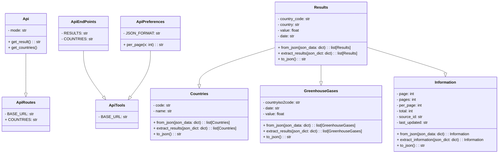
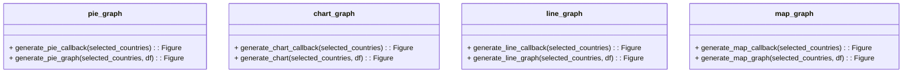

# Pyboard

## Introduction

Pyboard est un dashboard présentant le taux d'émission de gaz à effet de serre pour plus de 100 pays dans le monde sur une vingtaine d'années (allant de 1990 à 2020).

Nous avons choisis de prendre ce sujet car le sujet de l'écologie est un sujet important et touchant tous les êtres humains sans aucune exception, quel que soit la caste sociale ou l'origine.

## Outils et méthode de travail

Dans un premier temps, le jeu de données provient de l'api [worldbank](https://www.worldbank.org/en/home). Le lien de la documentation a été un peu compliqué a trouvé, mais voici [celui](https://datahelpdesk.worldbank.org/knowledgebase/articles/889392-about-the-indicators-api-documentation) que l'on a utilisé.

Concernant les outils utilisés pendant le développement, nous avons procéder comme suit:
- Établissement d'une base de connaissance à partir de la documentation et lors de la créatipon d'une "blibliothèque" de requêtes en utilisant le logiciel postman (vous pouvez trouver le fichier json pouvant être importé dans postman à la racine du dépôt)
- Mise en place du dépôt et attribution des tâches
- Mise en place de l'environnement python : de ce côté-là, cela n'a pas été difficile puisque l'on a tiré profit de l'outil pycharm qui propose la mise en place d'un environnement python virtuel dédié par projet
- Documentation sur dash
- Travail en parallèle sur l'api et sur le dashboard

## Guide utilisateur

Le projet utilise la version 3.11.4. Assurez vous donc d'avoir au minimum cette version installée ou une plus récente sur votre machine locale.

Si vous ne l'avez pas, rendez-vous sur le [site suivant](https://www.python.org/downloads) et téléchargez la version correspondante.

### Installation

Clonez le projet sur votre machine locale

```shell
git clone https://github.com/raph-o/PyBoard.git
```

Installez les blibliothèques additionnelles comme suit :

```shell
cd PyBoard
python -m pip install -r requirements.txt
```

### Démarrage

Pour lancer le dashboard, assurez vous d'être dans le répertoire Pyboard, et exécutez la commande suivante :
```shell
python main.py
```

### Utilisation

Une fois que vous avez démarré, rendez-vous à l'adresse indiquée par votre console. Vous devriez voir un message similaire dans cette dernière :
```shell
Dash is running on http://127.0.0.1:8050/

 * Serving Flask app 'main'
 * Debug mode: on
```

## Guide développeur

### Architecture du code

Nous avons pensé notre code de la manière la plus modulaire possible, nous avons par conséquent deux modules principaux : api et graphs.

Le module api va contenir les différentes classes relatives aux intéractions et à la construction de notre propre jeu de données à partir des réponses de l'api. Le module est pensé de manière modulaire : c'est à dire que rajouter un jeu de données pertinent pour l'étude est aisé, il suffit de créer un modèle avec des fonctions similaires à tous et ajouter la route dans la classe dédiée à cela.

Voici un diagramme de notre module api et de son sous-module modèles :



Le module graphs va contenir les différents graphiques du dashboard

Voici un diagramme du graphs :



Et enfin, voici le diagramme des fichiers main.py et layout.py qui sont les fers de lance du dashboard puisqu'ils gèrent respectivement les appels aux différents callbacks et la mise en page du dashboard :
```mermaid

```

## Etude

Comme vous l'aurez compris, notre étude porte sur le taux d'émissions de gaz à effet de serre des différents pays dans le monde.

On le sait, les pays ne font pas grand nombre d'effort pour réduire leur taux d'émission, malgré les différents évènements comme la cop 21 et consort où les pays se réunissent pour discuter d'un plan d'action pour la planète.

Passons directement à une analyse de deux pays importants et ayant une politique environnementale totalement différente : la france et l'allemagne.

