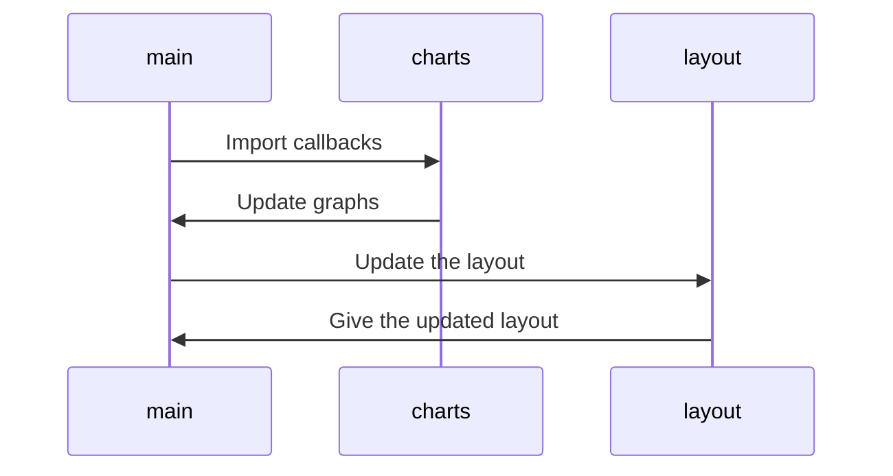
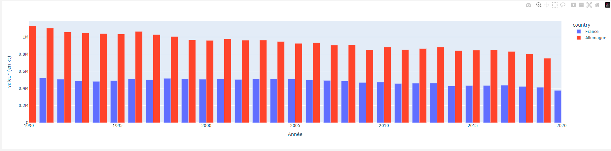
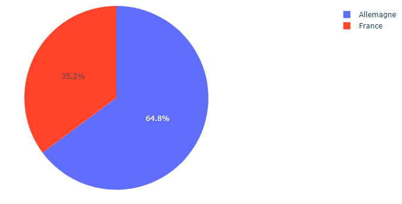
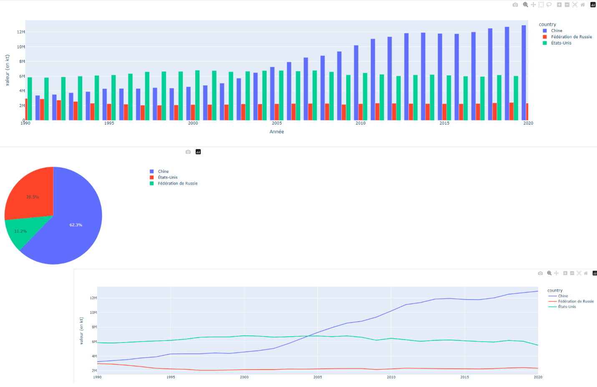

# Pyboard

## Introduction

Pyboard est un dashboard présentant le taux d'émission de gaz à effet de serre pour plus de 100 pays dans le monde sur une vingtaine d'années (allant de 1990 à 2020).

Nous avons choisi de prendre ce sujet, car le sujet de l'écologie est un sujet important et touchant tous les êtres humains sans aucune exception, quel que soit la caste sociale ou l'origine.

## Outils et méthode de travail

Dans un premier temps, le jeu de données provient de l'api [worldbank](https://www.worldbank.org/en/home). Le lien de la documentation a été un peu compliqué à trouver, mais voici [celui](https://datahelpdesk.worldbank.org/knowledgebase/articles/889392-about-the-indicators-api-documentation) que l'on a utilisé.

Concernant les outils utilisés pendant le développement, nous avons procédé comme suit:
- Établissement d'une base de connaissance à partir de la documentation et lors de la créatipon d'une "blibliothèque" de requêtes en utilisant le logiciel postman (vous pouvez trouver le fichier json pouvant être importé dans postman à la racine du dépôt)
- Mise en place du dépôt et attribution des tâches
- Mise en place de l'environnement python : de ce côté-là, cela n'a pas été difficile puisque l'on a tiré profit de l'outil pycharm qui propose la mise en place d'un environnement python virtuel dédié par projet
- Documentation sur dash
- Travail en parallèle sur l'api et sur le dashboard

## Guide utilisateur

Le projet utilise la version 3.11.4. Assurez-vous donc d'avoir au minimum cette version installée ou une plus récente sur votre machine locale.

Si vous ne l'avez pas, rendez-vous sur le [site suivant](https://www.python.org/downloads) et téléchargez la version correspondante.

### Installation

Clonez le projet sur votre machine locale

```shell
git clone https://github.com/raph-o/PyBoard.git
```

Installez les bibliothèques additionnelles comme suit :

```shell
cd PyBoard
python -m pip install -r requirements.txt
```

### Démarrage

Pour lancer le dashboard, assurez-vous d'être dans le répertoire Pyboard, et exécutez la commande suivante :
```shell
python main.py
```

### Utilisation

Une fois que vous avez démarré, rendez-vous à l'adresse indiquée par votre console. Vous devriez voir un message similaire dans cette dernière :
```shell
Dash is running on http://127.0.0.1:8050/

 * Serving Flask app 'main'
 * Debug mode: on
```

## Guide développeur

### Architecture du code

Nous avons pensé notre code de la manière la plus modulaire possible, nous avons par conséquent deux modules principaux : api et graphs.

Le module api va contenir les différentes classes relatives aux intéractions et à la construction de notre propre jeu de données à partir des réponses de l'api. Le module est pensé de manière modulaire : c'est-à-dire que rajouter un jeu de données pertinent pour l'étude est aisé, il suffit de créer un modèle avec des fonctions similaires à tous et ajouter la route dans la classe dédiée à cela.

Voici un diagramme de notre module api et de son sous-module modèle :


Le module graphs va contenir les différents graphiques du dashboard

Voici un diagramme du graphs :


Et enfin, voici le diagramme des fichiers main.py et layout.py qui sont les fers de lance du dashboard puisqu'ils gèrent respectivement les appels aux différents callbacks et la mise en page du dashboard :


## Etude

Comme vous l'aurez compris, notre étude porte sur le taux d'émissions de gaz à effet de serre des différents pays dans le monde.

On le sait, les pays ne font pas grand nombre d'effort pour réduire leur taux d'émission, malgré les différents évènements comme la cop 21 et consort où les pays se réunissent pour discuter d'un plan d'action pour la planète.

Passons directement à une analyse de deux pays importants et ayant une politique environnementale totalement différente : la france et l'allemagne.



Comme on peut le voir, l'Allemagne et la France sont deux pays à taux d'émission stagnant. Toutefois, on peut voir que la France est un pays bien moins polluant que l'Allemagne, entre autre car l'Allemagne a opéré à une sortie nucléaire, se basant beaucoup plus sur les énergies renouvelables et le charbon; alors que la France est un pays se basant fortement sur l'énergie nucléaire.

Si on prend donc un pourcentage du taux de pollution entre ces deux pays, on va obtenir quelque chose comme ça pour l'année 2020 :



La France est donc moins polluante, et ce, entre autre grâce aux différentes énergies renouvelables utilisées, mais aussi grâce au nucléaire. Même si ce dernier est mauvais à terme pour la planète temps que l'on n'a pas trouvée de moyen sûr et viable d'éliminer les déchets nucléaires, il est un moyen économique et sain de fournir de l'énergie.

Passons maintenant à trois autres pays qui sont parmi les plus puissants politiquement, économiquement et qui ont une influence à ne plus douter : La Russie, la Chine et les États-Unis.



Ce qui peut être le plus marquant, en dehors des chiffres qui sont au minimum deux fois plus hauts que les chiffres de la France et de l'Allemagne, c'est que la Chine continue toujours plus à polluer, alors que la Russie et les USA sont en stagnation.

Cela peut s'expliquer par le fait que la Chine est depuis quelques années un pays qui exporte énormément, et dont l'influence et la puissance ne cesse de progresser, telle que la Russie n'est peut-être plus le pays dont les USA devraient avoir peur.

Cela se voit encore plus avec les différentes actions lancées par Donald TRUMP sur les différentes entreprises chinoises et leurs opérations aux USA.

En conclusion, on peut constater que les plus grandes puissances ne cherchent pas spécialement à diminuer leurs émissions de CO2, comme on le voit sur les différents graphiques. Bien que l'heure soit plutôt à la stagnation qu'à l'augmentation, ce qui est un bon point en un sens, les différents accords conclus durant les conférences sur le climat ne sont jamais vraiment respectés et sont plutôt un moyen pour se faire bien voir auprès des populations.

Nous tendons à penser hypocritement que la planète est mourante, alors que c'est plutôt l'humanité. Une fois qu'elle ne sera plus habitable pour l'humain, et si nous mourrons tous du fait du climat, la nature reprendra ses droits comme si de rien était. Il faut donc changer radicalement nos manières de vivre afin d'être plus écologiques et vivre le plus longtemps possible. Même le geste le plus minime, s'il est fait par tout le monde, peut nous sauver d'une mort certaine.